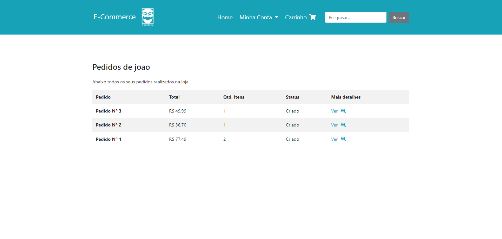

<div align="center">
  
 
 # 🛒 E-commerce Mr Robot, the e-commerce of all hackers 👨‍💻

 <p>
  
  
  
 </p>

 <br>

 <p>
   
   
   
   
   
 </p>

</div>

---

## 🤔 How to run locally

If you want to run it locally:

Requirements:

-   [Python](https://www.python.org/)

First and foremost, to run this its necessary that you create your virtual environment in this folder:

```bat
python -m venv venv
```

With the venv set, you need to install the [dependencies.txt](/dependencies.txt):

```bat
# On windows:

call venv/Scripts/activate.bat
pip install -r dependencies.txt
```

```bash	
# On linux:

source venv/bin/activate
pip install -r dependencies.txt
```

After installing the dependencies, just run `python manage.py runserver`

(Although you might need to migrate `python manage.py migrate` and create a super user to create new products `python manage.py createsuperuser`)

---

## 🤝 Contributing

Contributions, issues and feature requests are welcome!<br />Feel free to check [issues page](https://github.com/abacaxiguy/ecommerce-mr-robot/issues).

---

## 📋 Tested in

-   Windows 10 (Chrome 1600x900) ✔
-   Ubuntu (WSL2) ✔

---

<h4  align="center">Developed by 🍍</h4>
