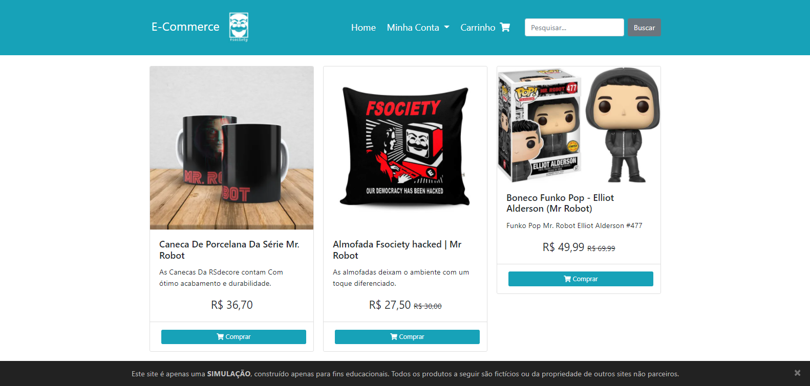
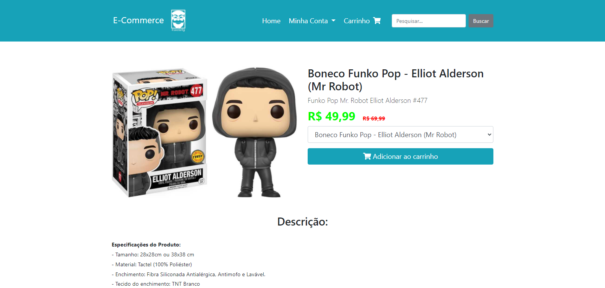
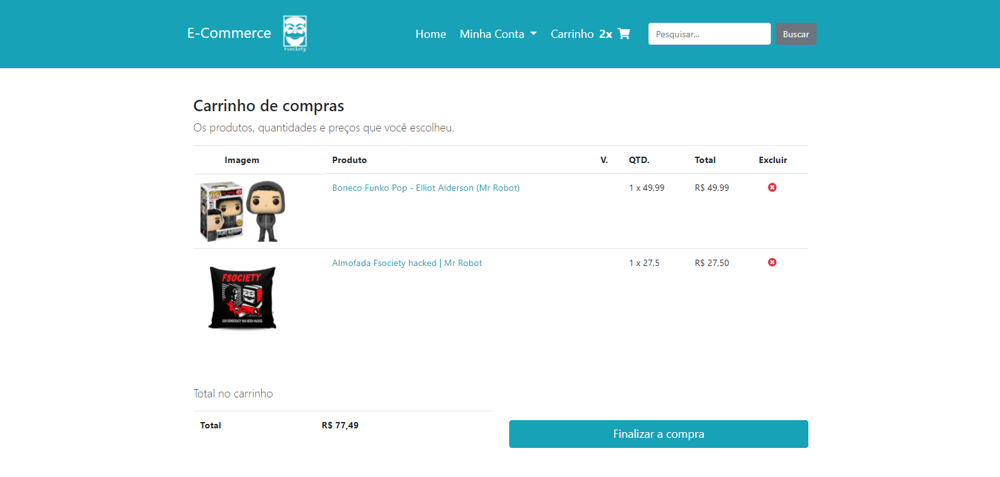
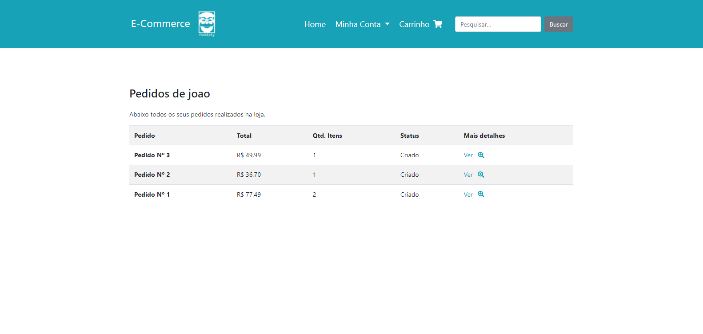

<h1 align="center">Ecommerce Mr Robot 🕴</h1>

<p align="center">
 
 
 
</p>
<h3 align="center">The e-commerce of all hackers 👨‍💻</h3>
<br>
<p align="center">
  
  
  
  
</p>

---

## 🤔 How to run locally

If you want to run it locally:

Requirements:

-   [Python](https://www.python.org/)

First and foremost, to run this its necessary that you create your virtual environment in this folder:

```bat
python -m venv venv
```

With the venv set, you need to install the [dependencies.txt](/dependencies.txt):

```bat
call venv/Scripts/activate.bat
pip install -r dependencies.txt
call venv/Scripts/deactivate.bat
```

After installing the dependencies, just run `python manage.py runserver`

(Although you might need to migrate `python manage.py migrate` and create a super user to create new products `python manage.py createsuperuser`)

---

## 🤝 Contributing

Contributions, issues and feature requests are welcome!<br />Feel free to check [issues page](https://github.com/abacaxiguy/antiprocrastinator/issues).

---

## 📋 Tested in

-   Chrome (1600x900), in Windows 10

---

<h4  align="center">Developed by 🍍</h4>
